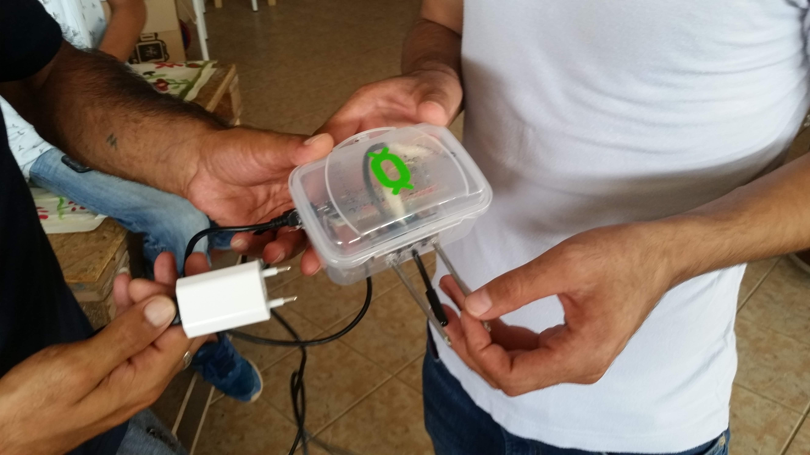
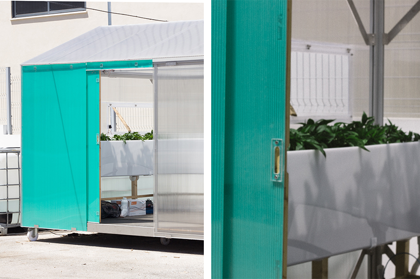

# 
#### Modular Open Agriculture

Enabling the implementation of Precision agriculture / Automation in any context or scale of production:
- from indoor hydroponics to traditional agriculture;
- from a balcony vase implementation to a large exploration;
- in an urban or rural context;
These modules can be useful for all, used together, adapted, remixed, distributed...

#### Your collaboration is precious! No onboarding needed, just start designing and developing!

# Modules V1 - ESP12 based version (under dev - design (boards, enclosures), firmware(arduino))


## soilProbe

- The soil probe reads Soil Moisture and Soil Temperature;
- You can add as many as you want in order to measure these in as many points as you wish.

### design
**eagleCAD:**
**Fusion 3D (plastic 3D print Enclosure):**

### code
**Arduino IDE Firmware:**


## waterRouter

- The water router uses a standart 1 in 4 out electrovalves from a washing machine. You should also decrease the water pressure on the outputs for microirrigation.
- You can use this directly to the network or after a motor (be careful with the pressure in compatibility). You can add as many as you want in the system.

### design
**eagleCAD:**
**Fusion 3D** (plastic 3D print Enclosure):

### code
**Arduino IDE Firmware:**


## core

- Core is the local server. Right now is mostly a test hub were the data from the networked servers is received and processed.
- We are using Node-Red but all collaboration is welcomed!

### design
Right now we are using a **standard Raspberry case.**

### code
**configure and install:**

#### configuring Raspberry Pi zero W as server

1. configuring the Pi
https://core-electronics.com.au/tutorials/raspberry-pi-zerow-headless-wifi-setup.html

2. Accessing through ssh on mac or linux terminal
https://www.raspberrypi.org/documentation/remote-access/ssh/unix.md

3. upgrade Node-Red and Node.js
- open terminal;
- commands:
```
sudo apt-get update
sudo apt-get upgrade
bash <(curl -sL https:/raw.githubusercontent.com/node-red/raspbian-deb-package/master/resources/update-nodejs-and-nodered)
sudo systemctl enable nodered.service
```
- Connect to Raspberry Pi Node-red console throught your browser be accessing ```http://"raspipaddress":1880```

- Install Mosquitto MQTT broker
```sudo apt-get install Mosquitto```

some instructions on how to test here: https://www.instructables.com/id/Installing-MQTT-BrokerMosquitto-on-Raspberry-Pi/

4. other useful links:
Security: manage permissions on node-red tutorial - https://www.youtube.com/watch?v=GeN7g4bdHiM


# Archived on this REPO You'll also find:

## mainSoilProbe REV0 - Developed at the Habibi Works (Ioannina, Greece) CultiMake Workshop - P2PLab - Archived
# 

### design
**eagleCAD:**
- A provisional board (not working!!) is on [/BOARDS/soilProbe/Archive](/BOARDS/soilProbe/Archive);
- For this example a nodeMCU dev board was used and tested at the workshop (see Habibi.Works [Workshop Journal](WORKSHOP/habibiWorksJuly2018/workshopJournal.md))
**enclosure:** A standard plastic box was used for demo purposes.

*This board includes:*
- 1 x 4 male header for DHT22 Temperature and Humidity Sensor
- 1 x 3 male header for DS18B20 (encapsulated version for Soil Temperature);
- 2 x 2 male header connections for Moisture 10k with Two probes;
- 1 led (no usage yet, mostly for debug purposes);
- 1 ftdi set headers;
- 1 voltage converter 12V - 3,3V;
- 1 x 2 screw headers to add solar panel + battery (maybe connect solar battery pack now).

### code
**Arduino IDE Firmware:** [/ARDUINO/habibiWorksJuly2018-WS/grouu-irr](/ARDUINO/habibiWorksJuly2018-WS/grouu-irr)


## GROUU greenhouse - Archived
# 

### design
**SolidWorks files** for the complete Structure (to be added) - also check constructive system (levosystems.com)
**Photos** (soon)
**Other Diagrams** (soon)


### code
**Arduino Yun code:** [/ARCHIVE/arduino/GROUU_GREENHOUSE_0/](/ARCHIVE/arduino/GROUU_GREENHOUSE_0/)


## Refs:
#### solarpower
https://www.aki.pt/electricidade/producao-energia-renovavel/solar-eolico-energia-propia/acessorios-de-energias-renovaveis/bateria/controladores/painelmanutencaobaterias-p10533.aspx#info
https://www.aki.pt/electricidade/producao-energia-renovavel/solar-eolico-energia-propia/kits-solares/kitbombadeaguamicrosolar-p49581.aspx
https://mauser.pt/catalog/product_info.php?products_id=82391

Main Probe

#### Multiple Analogs -

https://www.instructables.com/id/Multiple-Analog-Inputs-on-Only-One-Analoge-Pin/

#### ESP12 + DHT22 -

https://cityos.io/tutorial/2006/ESP12-and-DHT22

#### ESP12  + temp

https://iot-playground.com/blog/2-uncategorised/41-esp8266-ds18b20-temperature-sensor-arduino-ide

#### Voltage Regulator

http://www.ti.com/lit/ds/symlink/lm3480.pdf

#### use FTDI on ESP12

https://www.hackster.io/harshmangukiya/program-esp8266-esp-12e-with-arduino-using-ftdi-cable-2310c9


### refs fabrication:
#### eagle to flatCAM

http://caram.cl/software/flatcam/board-cutout-with-flatcam/
